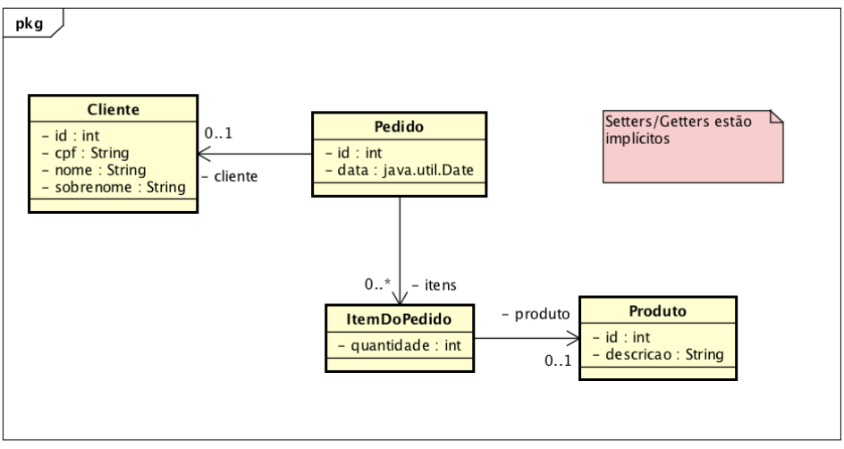
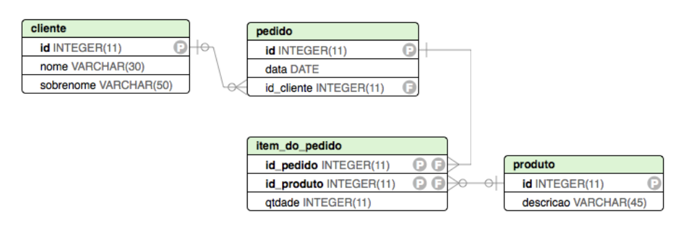

# Pós-graduação em desenvolvimento ágil de software
DAS - Trabalho Desenvolvimento Web 

Com base no diagrama de classes abaixo, construa um sistema para controlar o processo de pedido de produtos.
 

O sistema tem os seguintes requisitos:

1. Uma tela para manter (incluir, atualizar, excluir e listar) os clientes da empresa (Nome, sobrenome, CPF)

a. Nesta tela deve ser possível listar todos os clientes
b. Deve ser possível atualizar os dados de um cliente.
c. Deve ser possível excluir um cliente que não possua pedidos. Se houver uma tentativa de exclusão de clientes com pedidos uma mensagem do sistema deve informar ao usuário que o cliente não pode ser excluído.

2. Uma tela simples para manter os produtos disponíveis.

3. Uma tela para incluir os pedidos novos quando são comprados

a. Um campo para informar o CPF do cliente (O CPF deve ser único)
b. Uma lista de produtos (descrição)
c. Uma maneira para selecionar um produto
d. Um botão para incluir o produto selecionado no pedido do cliente, informando a quantidade do produto.

4. Uma tela para listar o pedido de um cliente.

a. Um campo para informar o CPF do cliente.
b. Um botão para listar os itens do pedido do cliente
c. Uma tabela para mostrar os itens do pedido:

Produto
Quantidade
Papel A4
2
Caneta esferográfica azul
20
Pasta
2

5. Considere as seguintes tabelas do banco de dados:
 

O programa acima deve utilizar as seguintes tecnologias:

- HTML/CSS/Javascript/DOM
- Angular
- Servidor rodando uma API REST em Spring 
- É permitido o uso de frameworks adicionais
- Não é permitido o uso de frameworks geradores de código, como por exemplo, Spring Roo

Elemento de Pesquisa:

	- Espera-se que a equipe consiga montar uma API REST simples em Spring
- O servidor pode rodar localmente
- Tutoriais e vídeos estão disponibilizados na página: http://www.razer.net.br/angular

Itens para serem entregues:

1. Código fonte (remover as bibliotecas e arquivos desnecessários para diminuir o tamanho da entrega)
2. Script para criação do banco de dados
3. Entrega toda no MOODLE

Avaliação:

- Equipes de seis pessoas no máximo
- Material entregue
- Qualidade do software (bugs encontrados na defesa)
- Defesa do código e a nota será individual, considerando a defesa
